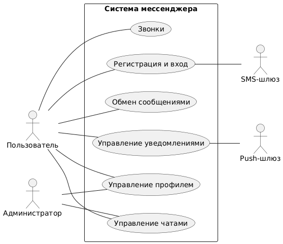
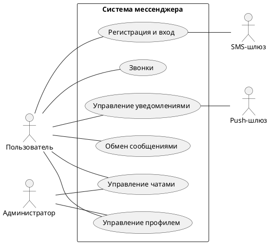

# Видение

## Введение
Основным объектом моделирования и проектирования является информационная система — **мессенджер**, позволяющий автоматизировать процесс мгновенного обмена сообщениями между пользователями.  

Система обеспечивает:
- регистрацию и аутентификацию пользователей;
- обмен текстовыми сообщениями в реальном времени;
- управление чатами (личные и групповые);
- управление профилем (никнейм, аватар, приватность);
- отправку уведомлений и поддержку звонков (аудио/видео).

---

## Позиционирование

### Место системы
Система мессенджера относится к классу клиент–серверных приложений реального времени и занимает нишу:
- повседневной личной коммуникации;
- общения внутри команд и групп;
- обмена оперативной информацией с сохранением истории переписки.

Система может использоваться как самостоятельный продукт или как встроенный модуль внутри более крупной платформы.

---

## Заинтересованные лица

### Заинтересованные лица, не являющиеся пользователями системы
- **Владельцы продукта / руководство компании** — заинтересованы в стабильной, безопасной и масштабируемой работе системы.
- **Команда сопровождения и администраторы** — заинтересованы в наблюдаемости, управляемости и устойчивости системы.

### Пользователи системы
- **Обычные пользователи** — общаются в чатах, обмениваются сообщениями, совершают звонки.
- **Администраторы / модераторы** — управляют чатами и данными пользователей, обеспечивают корректность работы.

---

## Цели высокого уровня

| Цель высокого уровня | Приоритет | Проблемы и замечания | Текущие решения |
| --- | --- | --- | --- |
| Обеспечить надёжный обмен сообщениями в реальном времени | Высокий | Возможные задержки и сбои доставки | Использование очередей, подтверждений доставки и сохранение сообщений в БД |
| Упростить управление чатами | Высокий | Ошибки прав, много чатов, низкая навигация | Менеджер чатов, индексированный поиск, строгая валидация |
| Дать пользователю контроль над профилем | Средний | Конфликтующие настройки, занятые никнеймы | Сервис профилей, валидация, кэширование |
| Обеспечить гибкую систему уведомлений | Высокий | Дубли, спам, ошибки доставки | Регистрация deviceToken, фильтрация, проверка активных устройств |
| Поддерживать звонки (аудио/видео) | Средний | Недоступность участников, сбои соединения | Сервис звонков, статусы звонков в БД, корректное завершение |

---

## Задачи уровня пользователя

Пользователи (и внешние системы) используют мессенджер в следующих целях:

### Регистрация и вход
- регистрация по номеру телефона с SMS-подтверждением;
- повторная отправка SMS-кода.

### Обмен сообщениями
- отправка сообщений и вложений;
- редактирование недавно отправленных сообщений;
- отображение статусов доставки.

### Управление чатами
- создание личных и групповых чатов;
- редактирование параметров чата;
- удаление чатов с правами владельца;
- поиск чатов.

### Управление профилем
- изменение никнейма;
- смена аватара;
- настройка приватности.

### Уведомления
- получение push-уведомлений;
- настройка режимов уведомлений (звук, mute, баннеры).

### Звонки
- инициирование аудио-/видеозвонка;
- принятие/отклонение вызова;
- завершение звонка.

---

## Перспективы продукта

Система мессенджера может использоваться:
- как самостоятельное приложение для общения;
- как встроенный компонент других сервисов (корпоративных платформ, CRM, обучающих систем и т.д.);
- как база для расширения функционала (боты, интеграции, реакции, файловое хранилище).

Ниже представлена контекстная диаграмма системы.

## Преимущества системы

| Свойство системы | Преимущества для заинтересованных лиц |
| --- | --- |
| Надёжный обмен сообщениями | Пользователи получают стабильный и быстрый канал коммуникации, сообщения не теряются, статусы доставки отображаются корректно |
| Управление чатами (создание, редактирование, удаление, поиск) | Удобная организация общения, возможность гибко структурировать взаимодействие (личные, групповые чаты) |
| Гибкие настройки профиля (никнейм, аватар, приватность) | Пользователи могут персонализировать аккаунт и контролировать, кто видит их данные |
| Система уведомлений с регистрацией устройств | Уменьшение лишних уведомлений, корректная доставка только на активные устройства, поддержка mute |
| Масштабируемая модульная архитектура | Позволяет развивать функционал (боты, звонки, вложения) без остановки работы системы |
| Валидация данных и кэширование | Снижается количество ошибок, уменьшается нагрузка на базу данных, повышается скорость работы |
| Поддержка звонков (аудио/видео) | Дополнительный канал коммуникации, расширенные возможности взаимодействия |
| Логирование и наблюдаемость | Упрощает диагностику, улучшает стабильность и прозрачность системы для администраторов |
| Централизованная работа с профилями и чатами | Повышает удобство управления данными, упрощает масштабирование |
| Удобство интеграции с внешними сервисами (SMS, Push) | Возможность расширения системы, улучшение пользовательского опыта при регистрации и уведомлениях |

## Основные свойства системы

- **Регистрация и аутентификация пользователей**  
  Регистрация по номеру телефона, подтверждение через SMS-код, поддержка повторной отправки кода.

- **Мгновенный обмен сообщениями**  
  Отправка и получение текстовых сообщений в реальном времени, гарантированная доставка, статусы отправки, хранение истории переписки.

- **Редактирование сообщений**  
  Возможность редактировать сообщение в пределах установленного времени, хранение отметки об изменении.

- **Управление чатами**  
  Создание личных и групповых чатов, редактирование названия и аватара, удаление чатов, проверка прав доступа.

- **Поиск по чатам**  
  Быстрый поиск по названию чата и другим параметрам.

- **Управление профилем**  
  Изменение никнейма, аватара, настроек приватности, кэширование профиля для быстрого доступа.

- **Система уведомлений**  
  Получение уведомлений о новых сообщениях, звонках и событиях, включая поддержку push-уведомлений и настройку режимов уведомления.

- **Регистрация устройств для push**  
  Сохранение deviceToken, обновление токена, проверка активности устройств.

- **Звонки (аудио/видео)**  
  Инициирование звонка, отправка уведомления о вызове, приём/отклонение, завершение звонка, запись статусов в БД.

- **Масштабируемая архитектура**  
  Разделение системы на специализированные сервисы: сообщения, чаты, профили, уведомления, звонки.

- **Централизованное хранилище данных**  
  Надёжное хранение пользователей, сообщений, чатов, уведомлений, профилей.

- **Кэширование данных**  
  Кэширование профилей, настроек, метаданных чатов для ускорения работы системы.

- **Логирование и отслеживание действий**  
  Журналирование ключевых операций: вход, отправка сообщения, изменение профиля, события чатов.

## Другие требования и ограничения

### Ограничения производительности
- Система должна поддерживать массовый параллельный обмен сообщениями.  
- Доставка сообщений должна происходить без значимых задержек.  
- Поиск по чатам должен выполняться быстро при большом числе записей.

### Ограничения надежности
- Все критически важные операции (создание сообщений, изменение профиля) должны логироваться.  
- Система должна корректно обрабатывать сбои внешних сервисов (SMS-шлюз, push-шлюз).  
- Должны быть предусмотрены механизмы повторной отправки push-уведомлений.

### Ограничения безопасности
- Все входящие запросы должны проходить аутентификацию и проверку прав.  
- Данные пользователей (аватары, сообщения, настройки) должны быть защищены от несанкционированного доступа.  
- Чувствительные данные должны передаваться по защищённому каналу (HTTPS/TLS).

### Ограничения на данные
- Ограничение на размеры вложений сообщений (изображений, файлов).  
- Правила для никнеймов: длина 3–32 символа, допустимые символы, уникальность.  
- Ограничения форматов загружаемых изображений (jpeg, png).

### Ограничения на взаимодействие с внешними сервисами
- SMS-шлюз может ограничивать количество сообщений в минуту.  
- Push-шлюзы (APNS/FCM) могут возвращать ошибки, требующие обработки.  
- Система должна корректно удалять неактивные push-токены.

### Требования к масштабируемости и расширяемости
- Архитектура должна позволять добавлять новые типы сообщений, реакций, ботов, файлового хранилища.  
- Сервисы должны масштабироваться независимо (messages, chats, notifications).

### Требования к документированию
- Полная спецификация требований, архитектура, описание API — в отдельных документах.  
- Модель прецедентов должна отражать все основные сценарии системы.

### Требования к удобству использования
- Интерфейс должен быть интуитивно понятным.  
- Уведомления должны быть корректно отображены и легко настраиваться.

