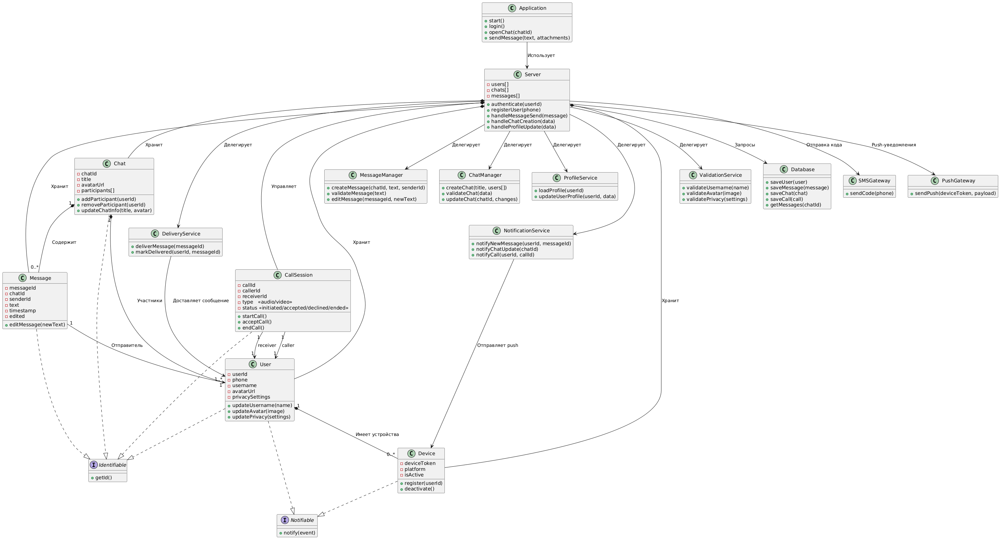
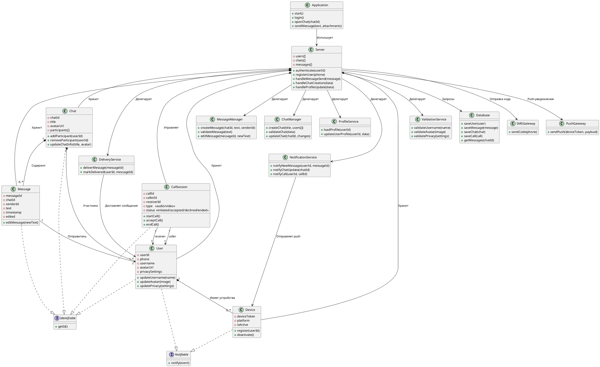

```plantuml
@startuml

class Application
{
    + start()
    + login()
    + openChat(chatId)
    + sendMessage(text, attachments)
}

class Server
{
    - users[]
    - chats[]
    - messages[]
    + authenticate(userId)
    + registerUser(phone)
    + handleMessageSend(message)
    + handleChatCreation(data)
    + handleProfileUpdate(data)
}

class User
{
    - userId
    - phone
    - username
    - avatarUrl
    - privacySettings
    + updateUsername(name)
    + updateAvatar(image)
    + updatePrivacy(settings)
}

class Chat
{
    - chatId
    - title
    - avatarUrl
    - participants[]
    + addParticipant(userId)
    + removeParticipant(userId)
    + updateChatInfo(title, avatar)
}

class Message
{
    - messageId
    - chatId
    - senderId
    - text
    - timestamp
    - edited
    + editMessage(newText)
}

class Device
{
    - deviceToken
    - platform
    - isActive
    + register(userId)
    + deactivate()
}

class CallSession
{
    - callId
    - callerId
    - receiverId
    - type   <<audio/video>>
    - status <<initiated/accepted/declined/ended>>
    + startCall()
    + acceptCall()
    + endCall()
}

class MessageManager
{
    + createMessage(chatId, text, senderId)
    + validateMessage(text)
    + editMessage(messageId, newText)
}

class ChatManager
{
    + createChat(title, users[])
    + validateChat(data)
    + updateChat(chatId, changes)
}

class ProfileService
{
    + loadProfile(userId)
    + updateUserProfile(userId, data)
}

class NotificationService
{
    + notifyNewMessage(userId, messageId)
    + notifyChatUpdate(chatId)
    + notifyCall(userId, callId)
}

class DeliveryService
{
    + deliverMessage(messageId)
    + markDelivered(userId, messageId)
}

class ValidationService
{
    + validateUsername(name)
    + validateAvatar(image)
    + validatePrivacy(settings)
}

class Database
{
    + saveUser(user)
    + saveMessage(message)
    + saveChat(chat)
    + saveCall(call)
    + getMessages(chatId)
}

class SMSGateway
{
    + sendCode(phone)
}

class PushGateway
{
    + sendPush(deviceToken, payload)
}

interface Identifiable
{
    + getId()
}

interface Notifiable
{
    + notify(event)
}

User ..|> Identifiable
Chat ..|> Identifiable
Message ..|> Identifiable
CallSession ..|> Identifiable

User ..|> Notifiable
Device ..|> Notifiable

Application --> Server : Использует
Server *-- User : Хранит
Server *-- Chat : Хранит
Server *-- Message : Хранит
Server *-- Device : Хранит
Server *-- CallSession : Управляет

Server --> MessageManager : Делегирует
Server --> ChatManager : Делегирует
Server --> ProfileService : Делегирует
Server --> NotificationService : Делегирует
Server --> DeliveryService : Делегирует
Server --> ValidationService : Делегирует
Server --> Database : Запросы
Server --> SMSGateway : Отправка кода
Server --> PushGateway : Push-уведомления

Chat "1" *-- "0..*" Message : Содержит
Chat "1" *-- "1..*" User : Участники

Message "1" --> "1" User : Отправитель

User "1" *-- "0..*" Device : Имеет устройства

CallSession "1" --> "1" User : caller
CallSession "1" --> "1" User : receiver

NotificationService --> Device : Отправляет push
DeliveryService --> User : Доставляет сообщение

@enduml
```
