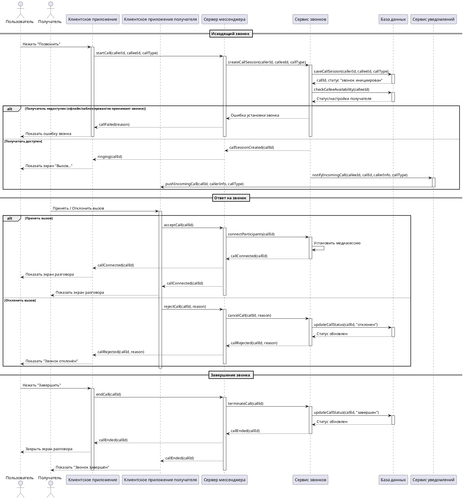

# Описание прецедента: Звонок (аудио/видео)

## Рамки  
Подсистема аудио- и видео-звонков мессенджера.

## Уровень  
Задача, определённая пользователем.

## Основной исполнитель  
Пользователь, совершающий звонок.

## Заинтересованные лица и их требования

**Звонящий пользователь:**  
- хочет быстро инициировать звонок;  
- хочет видеть статус звонка;  
- хочет завершить звонок в любой момент.

**Получатель:**  
- хочет увидеть уведомление о входящем звонке;  
- хочет иметь возможность принять или отклонить вызов.

**Система мессенджера:**  
- должна корректно устанавливать медиасессию;  
- должна уведомлять участников о статусе вызова;  
- должна завершать звонок корректно.

**Сервис звонков:**  
- отвечает за установление медиа-соединения;  
- должен обновлять статус звонка в базе данных.

## Предусловия
1. Оба пользователя зарегистрированы и авторизованы.  
2. Оба устройства имеют доступ к сети.  
3. Пользователь А имеет право позвонить пользователю Б.

## Постусловия
1. Звонок установлен, отклонён или завершён — статус записан в БД.  
2. Участники получили соответствующие уведомления.  
3. Медиасессия корректно завершена.

---

## Основной успешный сценарий

1. Пользователь выбирает контакт и нажимает «Позвонить».  
2. Клиентское приложение отправляет запрос серверу.  
3. Сервер создаёт сессию звонка через сервис звонков.  
4. Сессия сохраняется в базе данных.  
5. Получателю отправляется push-уведомление о входящем вызове.  
6. Получатель принимает вызов.  
7. Система устанавливает медиасессию между участниками.  
8. Оба участника находятся в режиме разговора.  
9. По завершении звонка сервер фиксирует статус «завершён».

---

## Альтернативные сценарии

### Получатель отклоняет звонок
- Система обновляет статус звонка → «отклонён».  
- Звонящий получает уведомление «Пользователь отклонил вызов».

### Получатель недоступен
- Система возвращает ошибку «Пользователь недоступен».  
- Звонящий получает соответствующее уведомление.

### Ошибка медиасессии
- Соединение не удалось установить.  
- Оба участника получают уведомление об ошибке.

---

## Частота использования
Средняя — используется регулярно, но реже, чем обмен сообщениями.

---

## Открытые вопросы
1. Нужно ли сохранять длительность каждого звонка?  
2. Должны ли звонки приходить сразу на все устройства пользователя?  
3. Нужен ли отдельный сервис для видеозвонков?

---

