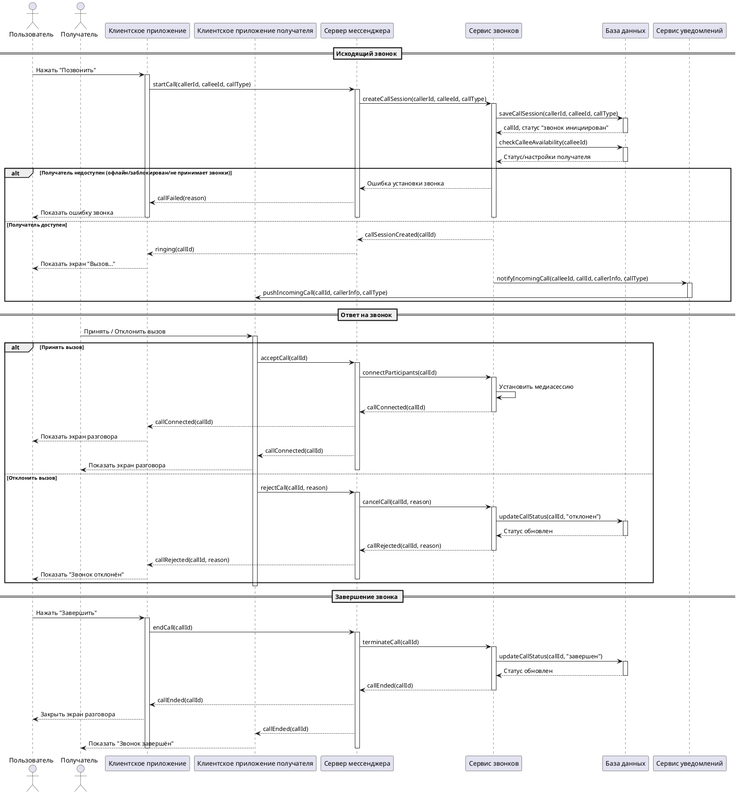

```plantuml
@startuml
actor "Пользователь" as User
actor "Получатель" as Callee
participant "Клиентское приложение" as App
participant "Клиентское приложение получателя" as CalleeApp
participant "Сервер мессенджера" as Server
participant "Сервис звонков" as CallService
participant "База данных" as DB
participant "Сервис уведомлений" as NotificationService

== Исходящий звонок ==

User -> App: Нажать "Позвонить"
activate App
App -> Server: startCall(callerId, calleeId, callType)
activate Server

Server -> CallService: createCallSession(callerId, calleeId, callType)
activate CallService

CallService -> DB: saveCallSession(callerId, calleeId, callType)
activate DB
DB --> CallService: callId, статус "звонок инициирован"
deactivate DB

CallService -> DB: checkCalleeAvailability(calleeId)
activate DB
DB --> CallService: Статус/настройки получателя
deactivate DB

alt Получатель недоступен (офлайн/заблокирован/не принимает звонки)
    CallService --> Server: Ошибка установки звонка
    Server --> App: callFailed(reason)
    App --> User: Показать ошибку звонка
    deactivate CallService
    deactivate Server
    deactivate App
else Получатель доступен
    CallService --> Server: callSessionCreated(callId)
    Server --> App: ringing(callId)
    App --> User: Показать экран "Вызов..."
    
    CallService -> NotificationService: notifyIncomingCall(calleeId, callId, callerInfo, callType)
    activate NotificationService
    NotificationService -> CalleeApp: pushIncomingCall(callId, callerInfo, callType)
    deactivate NotificationService
    
    deactivate CallService
    deactivate Server
    deactivate App
end

== Ответ на звонок ==

Callee -> CalleeApp: Принять / Отклонить вызов
activate CalleeApp

alt Принять вызов
    CalleeApp -> Server: acceptCall(callId)
    activate Server
    Server -> CallService: connectParticipants(callId)
    activate CallService
    
    CallService -> CallService: Установить медиасессию
    CallService --> Server: callConnected(callId)
    deactivate CallService
    
    Server --> App: callConnected(callId)
    App --> User: Показать экран разговора
    
    Server --> CalleeApp: callConnected(callId)
    CalleeApp --> Callee: Показать экран разговора
    deactivate Server
else Отклонить вызов
    CalleeApp -> Server: rejectCall(callId, reason)
    activate Server
    Server -> CallService: cancelCall(callId, reason)
    activate CallService
    
    CallService -> DB: updateCallStatus(callId, "отклонен")
    activate DB
    DB --> CallService: Статус обновлен
    deactivate DB
    
    CallService --> Server: callRejected(callId, reason)
    deactivate CallService
    
    Server --> App: callRejected(callId, reason)
    App --> User: Показать "Звонок отклонён"
    deactivate Server
end

deactivate CalleeApp

== Завершение звонка ==

User -> App: Нажать "Завершить"
activate App
App -> Server: endCall(callId)
activate Server

Server -> CallService: terminateCall(callId)
activate CallService

CallService -> DB: updateCallStatus(callId, "завершен")
activate DB
DB --> CallService: Статус обновлен
deactivate DB

CallService --> Server: callEnded(callId)
deactivate CallService

Server --> App: callEnded(callId)
App --> User: Закрыть экран разговора

Server --> CalleeApp: callEnded(callId)
CalleeApp --> Callee: Показать "Звонок завершён"

deactivate Server
deactivate App

@enduml
```
