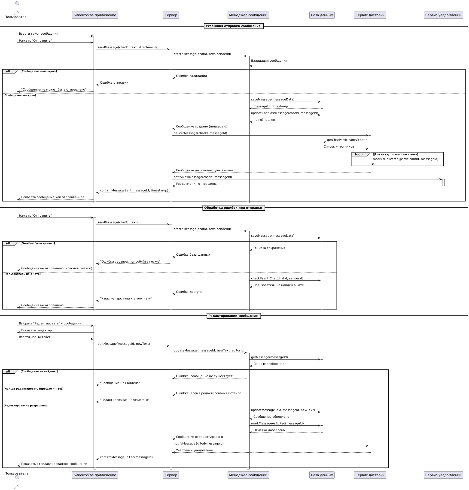

# Описание прецедента: Отправка и редактирование сообщения

## Рамки  
Подсистема обмена текстовыми сообщениями внутри чатов мессенджера.

## Уровень  
Задача, определённая пользователем.

## Основной исполнитель  
Пользователь мессенджера.

## Заинтересованные лица и их требования

**Пользователь:**  
- хочет быстро отправлять сообщения в выбранный чат;  
- хочет быть уверенным, что сообщение доставлено адресатам;  
- хочет иметь возможность исправить ошибку в недавно отправленном сообщении.

**Система мессенджера:**  
- должна валидировать содержимое сообщения и права пользователя;  
- должна надёжно сохранять сообщения в базе данных;  
- должна корректно обновлять состояние чата (последнее сообщение, статусы доставки);  
- должна позволять редактировать сообщение в допустимый интервал времени.

**Участники чата (получатели):**  
- хотят получать новые сообщения и видеть пометку об их редактировании.

## Предусловия
1. Пользователь авторизован в приложении.  
2. Пользователь является участником выбранного чата.  
3. Сервер мессенджера и база данных доступны.

## Постусловия
1. Сообщение сохранено в БД и связано с нужным чатом.  
2. Статусы доставки обновлены для участников чата.  
3. В случае редактирования обновлён текст сообщения и проставлена отметка «изменено».

---

## Основной успешный сценарий: Отправка сообщения

1. Пользователь вводит текст сообщения в клиентском приложении.  
2. Пользователь нажимает кнопку «Отправить».  
3. Клиентское приложение отправляет запрос `sendMessage(chatId, text, attachments)` на сервер.  
4. Сервер передаёт данные в менеджер сообщений.  
5. Менеджер сообщений валидирует сообщение (длина, формат, разрешённые типы вложений и т.п.).  
6. При успешной валидации сообщение сохраняется в базе данных.  
7. Менеджер сообщений обновляет информацию о последнем сообщении в чате.  
8. Сервер инициирует доставку через сервис доставки.  
9. Сервис доставки получает список участников чата и проставляет статусы доставки для каждого.  
10. Сервер вызывает сервис уведомлений для оповещения клиентов о новом сообщении.  
11. Клиентское приложение получает подтверждение `confirmMessageSent` и отображает сообщение как отправленное.

---

## Альтернативные сценарии: Ошибки при отправке

### Сообщение невалидно
- Валидация в `MessageManager` не проходит (пустой текст, слишком длинное сообщение и т.п.).  
- Сервер возвращает клиенту ошибку отправки.  
- Клиент отображает пользователю сообщение «Сообщение не может быть отправлено».

### Ошибка базы данных
- При сохранении сообщения в БД возникает ошибка.  
- Сервер возвращает текст «Ошибка сервера, попробуйте позже».  
- Клиент помечает сообщение как неотправленное (например, красным значком).

### Пользователь не является участником чата
- При проверке обнаруживается, что отправитель не состоит в указанном чате.  
- Сервер возвращает ошибку доступа.  
- Клиент отображает сообщение «У вас нет доступа к этому чату».

---

## Основной успешный сценарий: Редактирование сообщения

1. Пользователь выбирает уже отправленное сообщение и нажимает «Редактировать».  
2. Клиент показывает редактор текста сообщения.  
3. Пользователь вводит новый текст и подтверждает изменение.  
4. Клиент отправляет на сервер запрос `editMessage(messageId, newText)`.  
5. Сервер передаёт запрос в менеджер сообщений.  
6. Менеджер сообщений запрашивает исходное сообщение из базы данных.  
7. При наличии сообщения и соблюдении временного ограничения (например, не более 48 часов) текст обновляется, а сообщение помечается как отредактированное.  
8. Сервер уведомляет сервис доставки об изменении сообщения.  
9. Участники чата получают обновлённую версию сообщения.  
10. Клиентское приложение отправителя отображает отредактированный текст и пометку «изменено».

### Альтернативные сценарии при редактировании

- Сообщение не найдено — пользователь получает уведомление «Сообщение не найдено».  
- Время редактирования истекло — пользователь видит сообщение «Редактирование невозможно».

---

## Частота использования
Очень высокая — каждый пользователь регулярно отправляет и иногда редактирует сообщения.

---

## Открытые вопросы
1. Как обрабатываются вложения при редактировании (замена/удаление)?  
2. Нужно ли хранить историю версий отредактированных сообщений?  
3. Следует ли разрешать редактирование уже прочитанных сообщений или только непрочитанных?


---




```plantuml
@startuml

actor "Пользователь" as User
participant "Клиентское приложение" as App
participant "Сервер мессенджера" as Server
participant "Менеджер сообщений" as MessageManager
participant "База данных" as DB
participant "Сервис доставки" as DeliveryService
participant "Сервис уведомлений" as NotificationService

== Успешная отправка сообщения ==

User -> App: Ввести текст сообщения
activate App
User -> App: Нажать "Отправить"
App -> Server: sendMessage(chatId, text, attachments)
activate Server

Server -> MessageManager: createMessage(chatId, text, senderId)
activate MessageManager

MessageManager -> MessageManager: Валидация сообщения
alt Сообщение невалидно
    MessageManager --> Server: Ошибка валидации
    Server --> App: Ошибка отправки
    App --> User: "Сообщение не может быть отправлено"
else Сообщение валидно
    MessageManager -> DB: saveMessage(messageData)
    activate DB
    DB --> MessageManager: messageId, timestamp
    deactivate DB
    
    MessageManager -> DB: updateChatLastMessage(chatId, messageId)
    activate DB
    DB --> MessageManager: Чат обновлен
    deactivate DB
    
    MessageManager --> Server: Сообщение создано (messageId)
    Server -> DeliveryService: deliverMessage(chatId, messageId)
    activate DeliveryService
    
    DeliveryService -> DB: getChatParticipants(chatId)
    activate DB
    DB --> DeliveryService: Список участников
    deactivate DB
    
    loop Для каждого участника чата
        DeliveryService -> DeliveryService: markAsDelivered(participantId, messageId)
    end
    
    DeliveryService --> Server: Сообщение доставлено участникам
    deactivate DeliveryService
    
    Server -> NotificationService: notifyNewMessage(chatId, messageId)
    activate NotificationService
    NotificationService --> Server: Уведомления отправлены
    deactivate NotificationService
    
    Server --> App: confirmMessageSent(messageId, timestamp)
    App --> User: Показать сообщение как отправленное
end

deactivate MessageManager
deactivate Server
deactivate App

== Обработка ошибок при отправке ==

User -> App: Нажать "Отправить"
activate App
App -> Server: sendMessage(chatId, text)
activate Server

Server -> MessageManager: createMessage(chatId, text, senderId)
activate MessageManager

MessageManager -> DB: saveMessage(messageData)
activate DB

alt Ошибка базы данных
    DB --> MessageManager: Ошибка сохранения
    MessageManager --> Server: Ошибка базы данных
    Server --> App: "Ошибка сервера, попробуйте позже"
    App --> User: Сообщение не отправлено (красный значок)
    
else Пользователь не в чате
    MessageManager -> DB: checkUserInChat(chatId, senderId)
    DB --> MessageManager: Пользователь не найден в чате
    MessageManager --> Server: Ошибка доступа
    Server --> App: "У вас нет доступа к этому чату"
    App --> User: Сообщение не отправлено
end

deactivate DB
deactivate MessageManager
deactivate Server
deactivate App

== Редактирование сообщения ==

User -> App: Выбрать "Редактировать" у сообщения
activate App
App -> User: Показать редактор
User --> App: Ввести новый текст
App -> Server: editMessage(messageId, newText)
activate Server

Server -> MessageManager: updateMessage(messageId, newText, editorId)
activate MessageManager

MessageManager -> DB: getMessage(messageId)
activate DB
DB --> MessageManager: Данные сообщения
deactivate DB
alt Сообщение не найдено
    MessageManager --> Server: Ошибка: сообщение не существует
    Server --> App: "Сообщение не найдено"
else Нельзя редактировать (прошло > 48ч)
    MessageManager --> Server: Ошибка: время редактирования истекло
    Server --> App: "Редактирование невозможно"
else Редактирование разрешено
    MessageManager -> DB: updateMessageText(messageId, newText)
    activate DB
    DB --> MessageManager: Сообщение обновлено
    deactivate DB
    
    MessageManager -> DB: markMessageAsEdited(messageId)
    activate DB
    DB --> MessageManager: Отметка добавлена
    deactivate DB
    
    MessageManager --> Server: Сообщение отредактировано
    Server -> DeliveryService: notifyMessageEdited(messageId)
    activate DeliveryService
    DeliveryService --> Server: Участники уведомлены
    deactivate DeliveryService
    
    Server --> App: confirmMessageEdited(messageId)
    App --> User: Показать отредактированное сообщение
end

deactivate MessageManager
deactivate Server
deactivate App

@enduml
