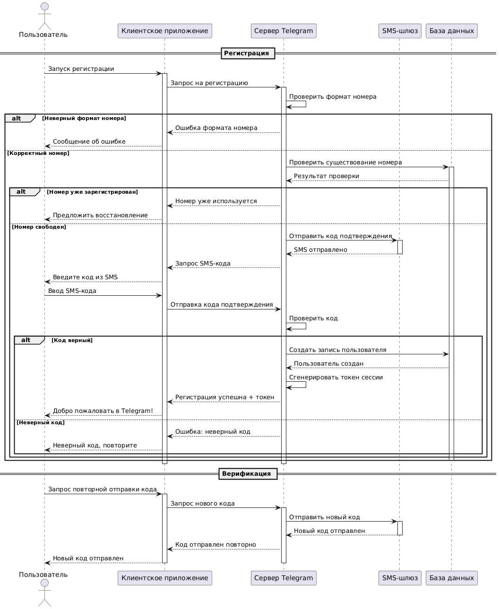
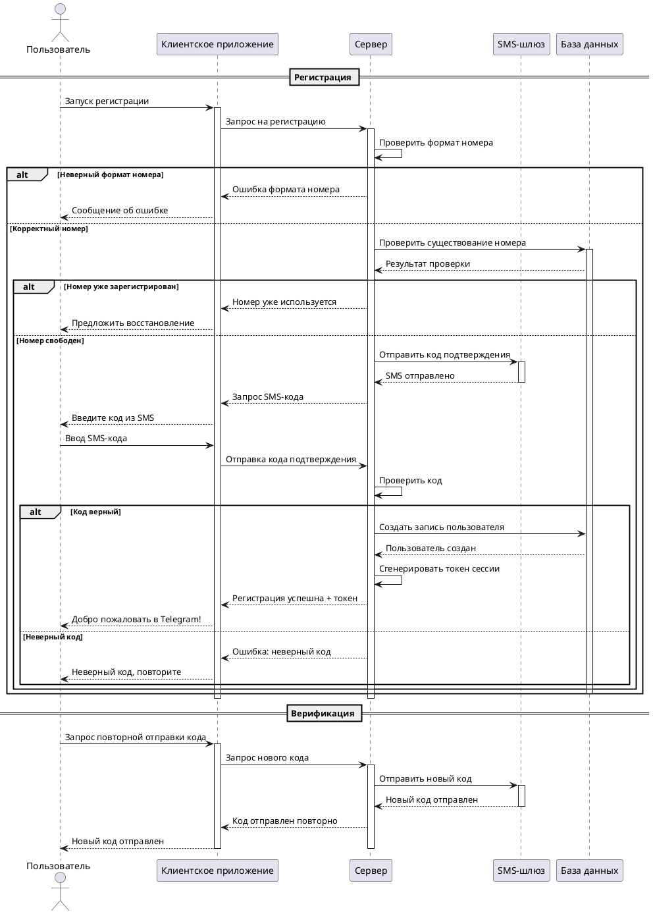

```plantuml
@startuml

actor "Пользователь" as User
participant "Клиентское приложение" as App
participant "Сервер" as Server
participant "SMS-шлюз" as SMS
participant "База данных" as DB

== Регистрация ==
User -> App: Запуск регистрации
activate App
App -> Server: Запрос на регистрацию
activate Server

Server -> Server: Проверить формат номера
alt Неверный формат номера
    Server --> App: Ошибка формата номера
    App --> User: Сообщение об ошибке
else Корректный номер
    Server -> DB: Проверить существование номера
    activate DB
    DB --> Server: Результат проверки
    
    alt Номер уже зарегистрирован
        Server --> App: Номер уже используется
        App --> User: Предложить восстановление
    else Номер свободен
        Server -> SMS: Отправить код подтверждения
        activate SMS
        SMS --> Server: SMS отправлено
        deactivate SMS
        
        Server --> App: Запрос SMS-кода
        App --> User: Введите код из SMS
        
        User -> App: Ввод SMS-кода
        App -> Server: Отправка кода подтверждения
        
        Server -> Server: Проверить код
        alt Код верный
            Server -> DB: Создать запись пользователя
            DB --> Server: Пользователь создан
            Server -> Server: Сгенерировать токен сессии
            Server --> App: Регистрация успешна + токен
            App --> User: Добро пожаловать в Telegram!
        else Неверный код
            Server --> App: Ошибка: неверный код
            App --> User: Неверный код, повторите
        end
    end
    deactivate DB
end

deactivate Server
deactivate App

== Верификация ==
User -> App: Запрос повторной отправки кода
activate App
App -> Server: Запрос нового кода
activate Server
Server -> SMS: Отправить новый код
activate SMS
SMS --> Server: Новый код отправлен
deactivate SMS
Server --> App: Код отправлен повторно
App --> User: Новый код отправлен
deactivate Server
deactivate App

@enduml
```
