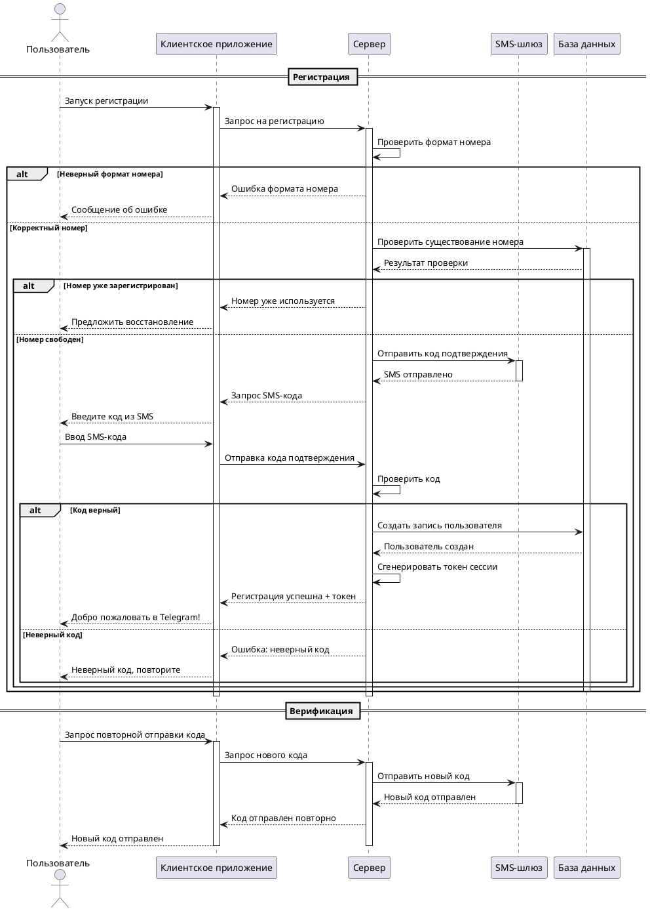

# Описание прецедента: Регистрация и верификация по SMS

## Рамки  
Регистрация нового пользователя в мессенджере и подтверждение номера телефона через SMS.

## Уровень  
Задача, определённая пользователем.

## Основной исполнитель  
Новый пользователь мессенджера.

## Заинтересованные лица и их требования

**Пользователь:**  
- хочет быстро зарегистрироваться с использованием номера телефона;  
- хочет получить понятное уведомление об ошибках ввода;  
- хочет знать, что его номер не используется кем-то ещё.

**Система мессенджера:**  
- должна проверять корректность формата номера;  
- должна исключать дубликаты зарегистрированных номеров;  
- должна надёжно связать аккаунт с подтверждённым номером.

**SMS-шлюз:**  
- ожидает корректные запросы на отправку SMS-кода.

## Предусловия
1. Пользователь установил и запустил клиентское приложение.  
2. Система имеет доступ к SMS-шлюзу.  

## Постусловия
1. При успешной регистрации создана запись пользователя в БД.  
2. Номер телефона помечен как подтверждённый.  
3. Пользователь получает токен сессии и доступ в приложение.

---

## Основной успешный сценарий: Регистрация

1. Пользователь запускает процесс регистрации в клиентском приложении.  
2. Клиент отправляет на сервер запрос с номером телефона.  
3. Сервер валидирует формат номера.  
4. Сервер проверяет в БД, не используется ли номер другим аккаунтом.  
5. Если номер свободен, сервер отправляет через SMS-шлюз код подтверждения.  
6. Пользователь получает SMS и вводит код в приложении.  
7. Клиент отправляет введённый код на сервер.  
8. Сервер сверяет код с ожидаемым значением.  
9. При совпадении сервер создаёт нового пользователя в БД.  
10. Сервер генерирует токен сессии и отправляет его клиенту.  
11. Пользователь попадает в основное окно мессенджера.

---

## Альтернативные сценарии

### Неверный формат номера
- Сервер обнаруживает некорректный формат.  
- Клиент выводит пользователю сообщение об ошибке ввода.

### Номер уже зарегистрирован
- БД возвращает, что номер уже используется.  
- Клиент предлагает перейти к восстановлению доступа/входу.

### Неверный SMS-код
- Пользователь вводит неправильный код.  
- Сервер возвращает ошибку «Неверный код, повторите попытку».

---

## Сценарий повторной верификации (отправка нового кода)

1. Пользователь запрашивает повторную отправку кода из приложения.  
2. Клиент отправляет запрос на сервер.  
3. Сервер запрашивает отправку нового кода у SMS-шлюза.  
4. Пользователь получает новый SMS-код и вводит его повторно.

---

## Частота использования
Низкая для одного пользователя (обычно один раз при регистрации), но высокая в масштабах всей системы.

---

## Открытые вопросы
1. Сколько попыток ввода кода допускается до блокировки?  
2. Как долго код подтверждения считается действительным?  
3. Нужна ли защита от массовой отправки SMS на один и тот же номер?

---

