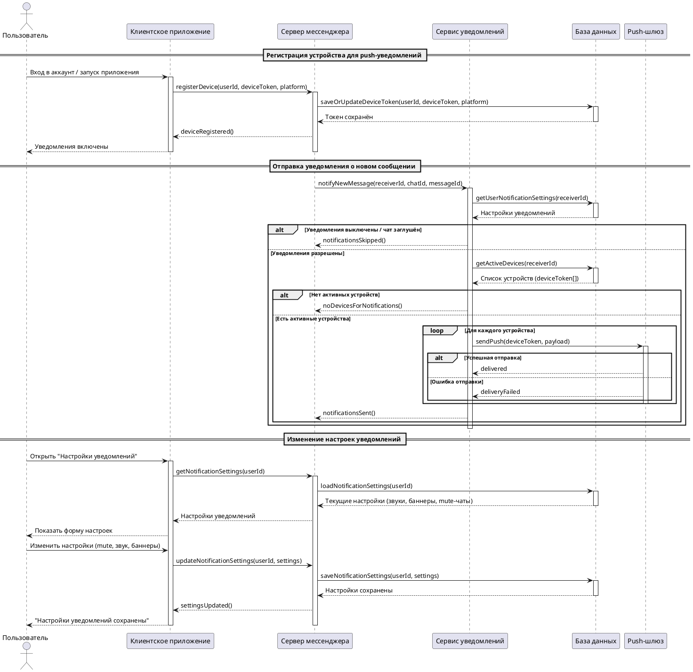

# Описание прецедента: Уведомления

## Рамки  
Подсистема уведомлений мессенджера.

## Уровень  
Задача, определённая пользователем.

## Основной исполнитель  
Пользователь мессенджера.

## Заинтересованные лица и их требования

**Пользователь:**  
- хочет своевременно получать уведомления о новых сообщениях;  
- хочет управлять режимами уведомлений (звук, баннеры, mute чата);  
- хочет, чтобы уведомления не приходили, если он их отключил.

**Система мессенджера:**  
- должна корректно сохранять push-токены устройств;  
- должна отправлять уведомления только тем пользователям, у которых включены уведомления;  
- должна корректно управлять настройками для разных устройств.

**Push-шлюз:**  
- ожидает валидные токены и корректные запросы на отправку push-уведомлений.

## Предусловия
1. Пользователь авторизован в приложении.  
2. Мобильное устройство имеет действительный push-токен.  
3. Пользователь ранее не отключил уведомления глобально или для конкретного чата.

## Постусловия
1. Устройство пользователя зарегистрировано на сервере.  
2. Уведомление о новом сообщении доставлено, либо корректно записан статус ошибки доставки.  
3. Изменённые настройки уведомлений сохранены в базе данных.

---

## Основной успешный сценарий

1. Пользователь запускает приложение, система отправляет на сервер `deviceToken`.  
2. Сервер сохраняет токен в базе данных.  
3. Пользователь получает подтверждение, что уведомления включены.  
4. При поступлении нового сообщения сервер вызывает сервис уведомлений.  
5. Сервис уведомлений проверяет настройки пользователя и список активных устройств.  
6. Push-уведомления отправляются через push-шлюз.  
7. Пользователь получает уведомление.  
8. Пользователь может изменить настройки уведомлений в меню приложения.  
9. Сервер сохраняет обновлённые параметры.  
10. Приложение сообщает пользователю об успешном изменении.

---

## Альтернативные сценарии

### Уведомления отключены пользователем
- Система не отправляет push-уведомления.

### Нет активных устройств
- Уведомления не отправляются, статус фиксируется.

### Ошибка push-шлюза
- Система фиксирует ошибку доставки и продолжает работу.

---

## Частота использования
Высокая — используется ежедневно при каждом новом сообщении.

---

## Открытые вопросы
1. Нужно ли хранить историю состояний доставки уведомлений?  
2. Должна ли система уведомлять пользователя о сбое доставки push-сообщения?  
3. Следует ли автоматически удалять `deviceToken`, если уведомления долго не доставляются?

---

