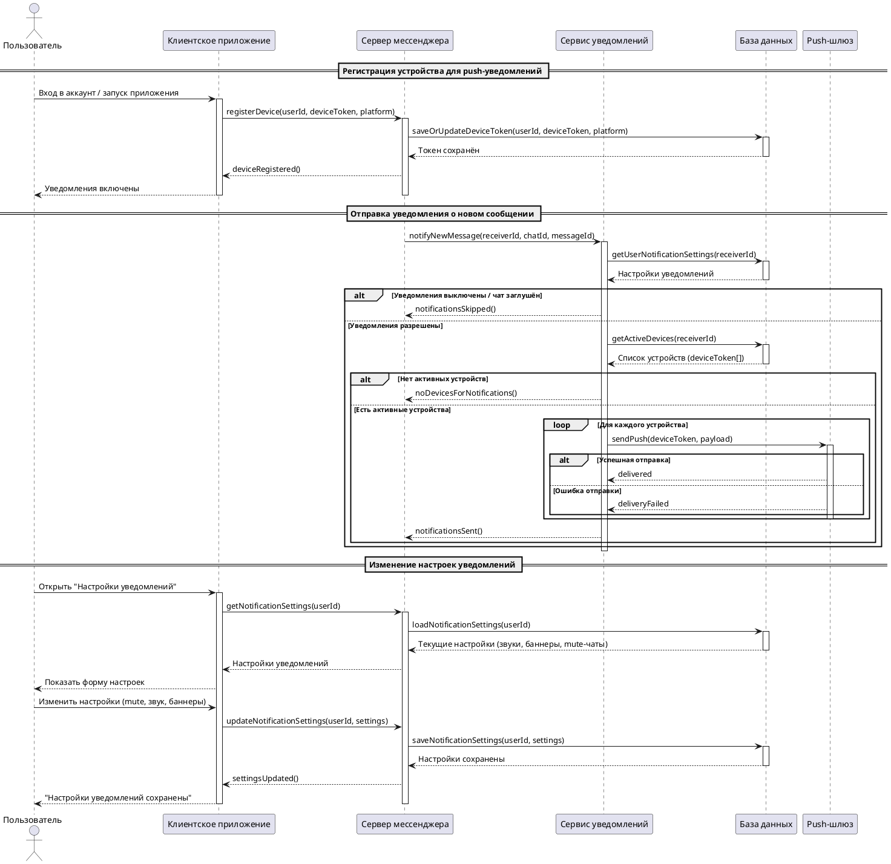

```plantuml
@startuml
actor "Пользователь" as User
participant "Клиентское приложение" as App
participant "Сервер мессенджера" as Server
participant "Сервис уведомлений" as NotificationService
participant "База данных" as DB
participant "Push-шлюз" as PushGateway

== Регистрация устройства для push-уведомлений ==

User -> App: Вход в аккаунт / запуск приложения
activate App
App -> Server: registerDevice(userId, deviceToken, platform)
activate Server

Server -> DB: saveOrUpdateDeviceToken(userId, deviceToken, platform)
activate DB
DB --> Server: Токен сохранён
deactivate DB

Server --> App: deviceRegistered()
App --> User: Уведомления включены
deactivate Server
deactivate App


== Отправка уведомления о новом сообщении ==

Server -> NotificationService: notifyNewMessage(receiverId, chatId, messageId)
activate NotificationService

NotificationService -> DB: getUserNotificationSettings(receiverId)
activate DB
DB --> NotificationService: Настройки уведомлений
deactivate DB

alt Уведомления выключены / чат заглушён
    NotificationService --> Server: notificationsSkipped()
else Уведомления разрешены

    NotificationService -> DB: getActiveDevices(receiverId)
    activate DB
    DB --> NotificationService: Список устройств (deviceToken[])
    deactivate DB

    alt Нет активных устройств
        NotificationService --> Server: noDevicesForNotifications()
    else Есть активные устройства

        loop Для каждого устройства
            NotificationService -> PushGateway: sendPush(deviceToken, payload)
            activate PushGateway

            alt Успешная отправка
                PushGateway --> NotificationService: delivered
            else Ошибка отправки
                PushGateway --> NotificationService: deliveryFailed
            end

            deactivate PushGateway
        end

        NotificationService --> Server: notificationsSent()
    end
end

deactivate NotificationService


== Изменение настроек уведомлений ==

User -> App: Открыть "Настройки уведомлений"
activate App
App -> Server: getNotificationSettings(userId)
activate Server

Server -> DB: loadNotificationSettings(userId)
activate DB
DB --> Server: Текущие настройки (звуки, баннеры, mute-чаты)
deactivate DB

Server --> App: Настройки уведомлений
App --> User: Показать форму настроек

User -> App: Изменить настройки (mute, звук, баннеры)
App -> Server: updateNotificationSettings(userId, settings)

Server -> DB: saveNotificationSettings(userId, settings)
activate DB
DB --> Server: Настройки сохранены
deactivate DB

Server --> App: settingsUpdated()
App --> User: "Настройки уведомлений сохранены"

deactivate Server
deactivate App

@enduml
```
