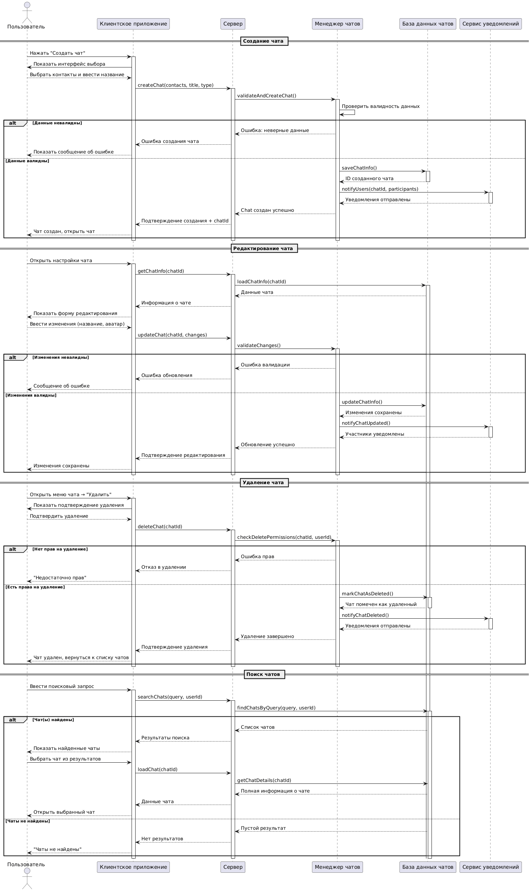

# Описание прецедента: Управление чатами

(создание, редактирование, удаление, поиск)

## Рамки  
Подсистема управления чатами в мессенджере.

## Уровень  
Задача, определённая пользователем.

## Основной исполнитель  
Пользователь мессенджера.

## Заинтересованные лица и их требования

**Пользователь:**  
- хочет создавать личные и групповые чаты;  
- хочет изменять название и аватар чата;  
- хочет удалять чаты, где он обладает соответствующими правами;  
- хочет быстро находить нужный чат по поиску.

**Система мессенджера / менеджер чатов:**  
- должна валидировать входные данные (участники, тип чата, название);  
- должна хранить структуру чатов в БД;  
- должна уведомлять участников об изменениях.

## Предусловия
1. Пользователь авторизован.  
2. Список его контактов и существующие чаты доступны системе.

## Постусловия
1. При создании чата — запись о чате сохранена в БД, участники уведомлены.  
2. При редактировании — обновлены данные чата и разосланы уведомления.  
3. При удалении — чат помечен как удалённый, участники уведомлены.  
4. При поиске — пользователю показан список найденных чатов или сообщение об отсутствии результатов.

---

## Основной успешный сценарий: Создание чата

1. Пользователь нажимает «Создать чат» в клиентском приложении.  
2. Клиент показывает интерфейс выбора участников и ввода названия.  
3. Пользователь выбирает контакты, задаёт тип (личный/групповой) и название чата.  
4. Клиент отправляет `createChat(contacts, title, type)` на сервер.  
5. Сервер передаёт запрос в менеджер чатов.  
6. Менеджер чатов проверяет корректность данных (участники, ограничения по размеру и т.п.).  
7. При успешной проверке чат создаётся и сохраняется в `ChatDB`.  
8. Менеджер чатов инициирует уведомление участников через сервис уведомлений.  
9. Клиент получает подтверждение и открывает созданный чат.

### Альтернативный сценарий при создании чата

- Данные некорректны (нет участников, слишком длинное название и т.п.) — пользователь получает сообщение об ошибке.

---

## Основной успешный сценарий: Редактирование чата

1. Пользователь открывает настройки чата.  
2. Клиент запрашивает у сервера информацию о чате.  
3. Сервер загружает данные чата из БД.  
4. Пользователь изменяет параметры (название, аватар).  
5. Клиент отправляет `updateChat(chatId, changes)` на сервер.  
6. Менеджер чатов валидирует изменения.  
7. При успешной валидации данные чата обновляются в БД.  
8. Участники чата получают уведомление об изменениях.  
9. Клиент отображает обновлённые параметры чата.

### Альтернативный сценарий при редактировании

- Изменения не проходят валидацию — пользователю выводится сообщение об ошибке, данные не сохраняются.

---

## Основной успешный сценарий: Удаление чата

1. Пользователь открывает меню чата и выбирает «Удалить».  
2. Клиент показывает диалог подтверждения.  
3. Пользователь подтверждает удаление.  
4. Клиент отправляет `deleteChat(chatId)` на сервер.  
5. Сервер через менеджер чатов проверяет права пользователя на удаление.  
6. При наличии прав чат помечается как удалённый в базе данных.  
7. Сервис уведомлений оповещает участников о том, что чат удалён.  
8. Клиент удаляет чат из списка и возвращает пользователя к перечню чатов.

### Альтернативный сценарий при удалении

- У пользователя нет прав — сервер возвращает отказ, клиент показывает сообщение «Недостаточно прав».

---

## Основной успешный сценарий: Поиск чатов

1. Пользователь вводит поисковый запрос в поле поиска чатов.  
2. Клиент отправляет запрос `searchChats(query, userId)` на сервер.  
3. Сервер запрашивает в БД чаты, доступные пользователю и соответствующие запросу.  
4. При наличии результатов список чатов возвращается клиенту и отображается пользователю.  
5. Пользователь выбирает чат из результатов, клиент загружает его детали и открывает.

### Альтернативный сценарий при поиске

- Чаты по запросу не найдены — пользователю показывается сообщение «Чаты не найдены».

---

## Частота использования
Высокая — создание и поиск чатов происходят регулярно, редактирование и удаление — по мере необходимости.

---

## Открытые вопросы
1. Нужно ли жёстко удалять чаты или достаточно пометки «удалён»?  
2. Должна ли система поддерживать разные роли внутри чата (владелец, администратор, участник)?  
3. Какие поля должны участвовать в поиске (название, участники, последние сообщения)?

---



```plantuml
@startuml

actor "Пользователь" as User
participant "Клиентское приложение" as App
participant "Сервер мессенджера" as Server
participant "Сервис профилей" as ProfileService
participant "База данных" as DB
participant "Сервис валидации" as ValidationService
participant "Кэш пользователей" as Cache

== Смена никнейма ==

User -> App: Открыть настройки профиля
activate App
App -> Server: getProfileSettings(userId)
activate Server
Server -> ProfileService: loadUserProfile(userId)
activate ProfileService
ProfileService -> DB: getUserData(userId)
activate DB
DB --> ProfileService: Данные пользователя
deactivate DB
ProfileService --> Server: Профиль загружен
Server --> App: Текущие настройки профиля
App --> User: Показать форму редактирования

User -> App: Ввести новый никнейм
App -> Server: updateUsername(userId, newUsername)
activate Server
Server -> ValidationService: validateUsername(newUsername)
activate ValidationService

ValidationService -> ValidationService: Проверить правила:
ValidationService -> ValidationService: - Длина (3-32 символа)
ValidationService -> ValidationService: - Разрешенные символы
ValidationService -> ValidationService: - Уникальность
ValidationService -> DB: checkUsernameAvailability(newUsername)
activate DB
DB --> ValidationService: Доступность никнейма
deactivate DB

alt Никнейм невалиден
    ValidationService --> Server: Ошибка валидации
    Server --> App: Причина ошибки
    App --> User: "Никнейм не соответствует требованиям"
else Никнейм занят
    ValidationService --> Server: Ошибка: никнейм занят
    Server --> App: "Этот никнейм уже используется"
    App --> User: Предложить альтернативы
else Никнейм валиден
    ValidationService --> Server: Валидация пройдена
    Server -> ProfileService: updateUserProfile(userId, {username: newUsername})
    ProfileService -> DB: updateUserData(userId, newUsername)
    activate DB
    DB --> ProfileService: Данные обновлены
    deactivate DB
    
    ProfileService -> Cache: invalidateUserCache(userId)
    activate Cache
    Cache --> ProfileService: Кэш очищен
    deactivate Cache
    
    ProfileService --> Server: Профиль обновлен
    Server --> App: Подтверждение изменения
    App --> User: "Никнейм успешно изменен"
end

deactivate ValidationService
deactivate Server
deactivate App

== Изменение настроек приватности ==

User -> App: Открыть "Настройки приватности"
activate App
App -> Server: getPrivacySettings(userId)
activate Server
Server -> ProfileService: loadPrivacySettings(userId)
activate ProfileService
ProfileService -> DB: getPrivacySettings(userId)
activate DB
DB --> ProfileService: Текущие настройки
deactivate DB
ProfileService --> Server: Настройки приватности
Server --> App: Текущие параметры
App --> User: Показать настройки приватности

User -> App: Изменить параметры приватности
App -> Server: updatePrivacySettings(userId, settings)
activate Server

Server -> ProfileService: validateAndUpdatePrivacy(settings)
activate ProfileService

ProfileService -> ProfileService: Проверить корректность настроек:
ProfileService -> ProfileService: - Кто может видеть профиль
ProfileService -> ProfileService: - Кто может писать в ЛС
ProfileService -> ProfileService: - Кто может добавлять в контакты

alt Настройки невалидны
    ProfileService --> Server: Ошибка валидации
    Server --> App: "Некорректные настройки приватности"
    App --> User: Сообщение об ошибке
else Настройки валидны
    ProfileService -> DB: updatePrivacySettings(userId, settings)
    activate DB
    DB --> ProfileService: Настройки сохранены
    deactivate DB
    
    ProfileService -> Cache: updatePrivacyCache(userId, settings)
    activate Cache
    Cache --> ProfileService: Кэш обновлен
    deactivate Cache
    
    ProfileService --> Server: Настройки обновлены
    Server --> App: Подтверждение изменения
    App --> User: "Настройки приватности сохранены"
end

deactivate ProfileService
deactivate Server
deactivate App

== Изменение аватара ==
User -> App: Нажать "Изменить аватар"
activate App
App -> User: Предложить выбор: камера/галерея
User --> App: Выбрать изображение
App -> App: Сжать и обработать изображение
App -> Server: uploadAvatar(userId, imageData)
activate Server

Server -> ValidationService: validateAvatar(imageData)
activate ValidationService
ValidationService -> ValidationService: Проверить:
ValidationService -> ValidationService: - Размер файла
ValidationService -> ValidationService: - Формат
ValidationService -> ValidationService: - Разрешение

alt Изображение невалидно
    ValidationService --> Server: Ошибка валидации
    Server --> App: "Некорректное изображение"
    App --> User: Сообщение об ошибке
else Изображение валидно
    ValidationService --> Server: Валидация пройдена
    Server -> ProfileService: updateUserAvatar(userId, imageData)
    activate ProfileService
    
    ProfileService -> DB: storeAvatar(userId, imageData)
    activate DB
    DB --> ProfileService: Аватар сохранен
    deactivate DB
    
    ProfileService -> Cache: updateAvatarCache(userId, avatarUrl)
    activate Cache
    Cache --> ProfileService: Кэш обновлен
    deactivate Cache
    
    ProfileService --> Server: Аватар обновлен
    Server --> App: URL нового аватара
    App --> User: Показать новый аватар
end

deactivate ValidationService
deactivate Server
deactivate App

@enduml
