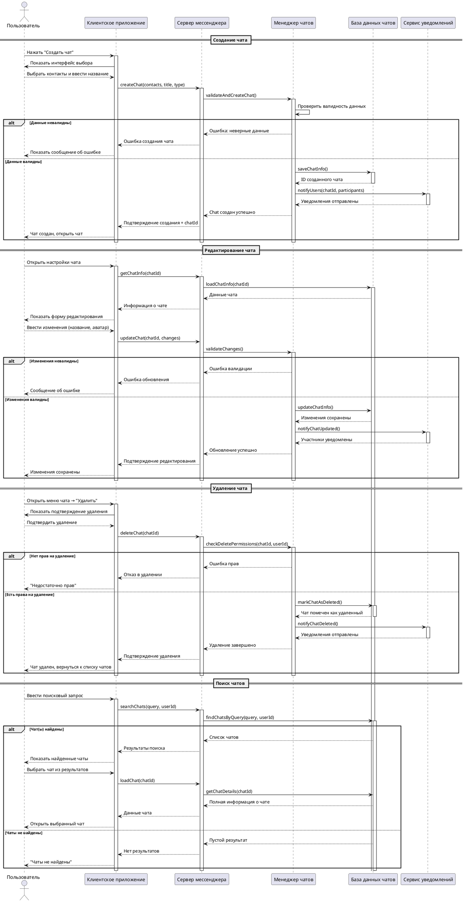

```plantuml
@startuml

actor "Пользователь" as User
participant "Клиентское приложение" as App
participant "Сервер мессенджера" as Server
participant "Менеджер чатов" as ChatManager
participant "База данных чатов" as ChatDB
participant "Сервис уведомлений" as Notifications

== Создание чата ==

User -> App: Нажать "Создать чат"
activate App

App -> User: Показать интерфейс выбора
User --> App: Выбрать контакты и ввести название
App -> Server: createChat(contacts, title, type)
activate Server

Server -> ChatManager: validateAndCreateChat()
activate ChatManager

ChatManager -> ChatManager: Проверить валидность данных
alt Данные невалидны
    ChatManager --> Server: Ошибка: неверные данные
    Server --> App: Ошибка создания чата
    App --> User: Показать сообщение об ошибке
else Данные валидны
    ChatManager -> ChatDB: saveChatInfo()
    activate ChatDB
    ChatDB --> ChatManager: ID созданного чата
    deactivate ChatDB
    
    ChatManager -> Notifications: notifyUsers(chatId, participants)
    activate Notifications
    Notifications --> ChatManager: Уведомления отправлены
    deactivate Notifications
    
    ChatManager --> Server: Chat создан успешно
    Server --> App: Подтверждение создания + chatId
    App --> User: Чат создан, открыть чат
end

deactivate ChatManager
deactivate Server
deactivate App

== Редактирование чата ==

User -> App: Открыть настройки чата
activate App
App -> Server: getChatInfo(chatId)
activate Server
Server -> ChatDB: loadChatInfo(chatId)
activate ChatDB
ChatDB --> Server: Данные чата
Server --> App: Информация о чате
App --> User: Показать форму редактирования

User --> App: Ввести изменения (название, аватар)
App -> Server: updateChat(chatId, changes)
Server -> ChatManager: validateChanges()
activate ChatManager

alt Изменения невалидны
    ChatManager --> Server: Ошибка валидации
    Server --> App: Ошибка обновления
    App --> User: Сообщение об ошибке
else Изменения валидны
    ChatManager -> ChatDB: updateChatInfo()
    ChatDB --> ChatManager: Изменения сохранены
    ChatManager -> Notifications: notifyChatUpdated()
    activate Notifications
    Notifications --> ChatManager: Участники уведомлены
    deactivate Notifications
    ChatManager --> Server: Обновление успешно
    Server --> App: Подтверждение редактирования
    App --> User: Изменения сохранены
end

deactivate ChatManager
deactivate Server
deactivate App

== Удаление чата ==

User -> App: Открыть меню чата → "Удалить"
activate App
App -> User: Показать подтверждение удаления
User --> App: Подтвердить удаление
App -> Server: deleteChat(chatId)
activate Server

Server -> ChatManager: checkDeletePermissions(chatId, userId)
activate ChatManager

alt Нет прав на удаление
    ChatManager --> Server: Ошибка прав
    Server --> App: Отказ в удалении
    App --> User: "Недостаточно прав"
else Есть права на удаление
    ChatManager -> ChatDB: markChatAsDeleted()
    activate ChatDB
    ChatDB --> ChatManager: Чат помечен как удаленный
    deactivate ChatDB
    
    ChatManager -> Notifications: notifyChatDeleted()
    activate Notifications
    Notifications --> ChatManager: Уведомления отправлены
    deactivate Notifications
    
    ChatManager --> Server: Удаление завершено
    Server --> App: Подтверждение удаления
    App --> User: Чат удален, вернуться к списку чатов
end

deactivate ChatManager
deactivate Server
deactivate App

== Поиск чатов ==

User -> App: Ввести поисковый запрос
activate App
App -> Server: searchChats(query, userId)
activate Server

Server -> ChatDB: findChatsByQuery(query, userId)
activate ChatDB

alt Чат(ы) найдены
    ChatDB --> Server: Список чатов
    Server --> App: Результаты поиска
    App --> User: Показать найденные чаты
    
    User -> App: Выбрать чат из результатов
    App -> Server: loadChat(chatId)
    Server -> ChatDB: getChatDetails(chatId)
    ChatDB --> Server: Полная информация о чате
    Server --> App: Данные чата
    App --> User: Открыть выбранный чат
else Чаты не найдены
    ChatDB --> Server: Пустой результат
    Server --> App: Нет результатов
    App --> User: "Чаты не найдены"
end
deactivate ChatDB
deactivate Server
deactivate App

@enduml
```
