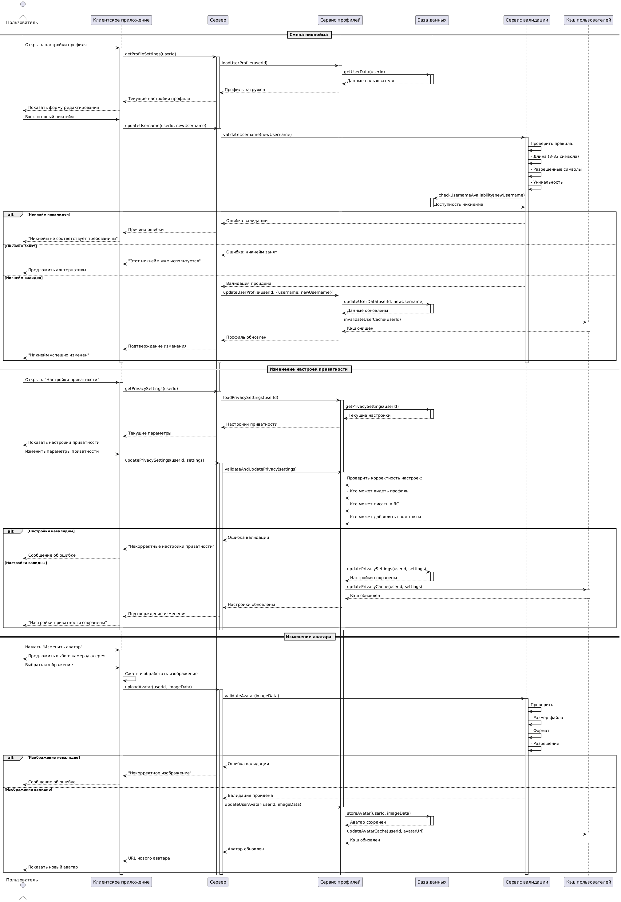
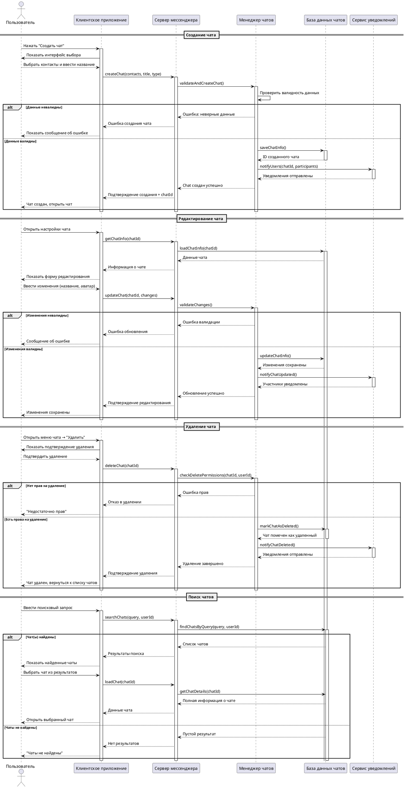

# Описание прецедента: Управление профилем пользователя

(смена никнейма, настройки приватности, аватар)

## Рамки  
Подсистема управления профилем пользователя в мессенджере.

## Уровень  
Задача, определённая пользователем.

## Основной исполнитель  
Авторизованный пользователь мессенджера.

## Заинтересованные лица и их требования

**Пользователь:**  
- хочет менять свой никнейм и аватар;  
- хочет управлять видимостью профиля и доступностью личных сообщений;  
- хочет получать понятные сообщения об ошибках при неверных настройках.

**Система профилей/валидации:**  
- должна проверять уникальность и корректность никнейма;  
- должна валидировать настройки приватности;  
- должна надёжно хранить и обновлять данные в БД и кэше.

## Предусловия
1. Пользователь авторизован.  
2. Профиль пользователя существует в базе данных.  

## Постусловия
1. Изменённые данные профиля сохранены в БД.  
2. Кэш профиля и настроек актуализирован.  
3. Клиентское приложение отобразило обновлённую информацию.

---

## Основной успешный сценарий: Смена никнейма

1. Пользователь открывает настройки профиля.  
2. Клиент запрашивает текущие настройки у сервера.  
3. Сервер загружает профиль пользователя через сервис профилей.  
4. Пользователь видит форму редактирования никнейма.  
5. Пользователь вводит новый никнейм.  
6. Клиент отправляет запрос `updateUsername(userId, newUsername)` на сервер.  
7. Сервер передаёт никнейм в сервис валидации.  
8. Сервис валидации проверяет длину, допустимые символы и уникальность никнейма.  
9. При успешной проверке профиль обновляется в БД.  
10. Кэш пользователя инвалидируется/обновляется.  
11. Клиент получает подтверждение и показывает сообщение «Никнейм успешно изменён».

### Альтернативные сценарии при смене никнейма

- Никнейм не соответствует правилам — пользователь получает сообщение о нарушении ограничений.  
- Никнейм уже занят — пользователю предлагается выбрать другой.

---

## Основной успешный сценарий: Изменение настроек приватности

1. Пользователь открывает раздел «Настройки приватности».  
2. Клиент запрашивает текущие настройки у сервера.  
3. Сервер загружает их из БД через сервис профилей.  
4. Пользователь меняет параметры приватности (кто видит профиль, кто может писать в ЛС и т.д.).  
5. Клиент отправляет новые настройки на сервер.  
6. Сервис профилей валидирует сочетание настроек.  
7. При корректных настройках данные сохраняются в БД.  
8. Кэш приватности обновляется.  
9. Пользователь видит сообщение «Настройки приватности сохранены».

### Альтернативные сценарии при настройке приватности

- Настройки конфликтуют или некорректны — система сообщает пользователю об ошибке без сохранения изменений.

---

## Основной успешный сценарий: Изменение аватара

1. Пользователь нажимает «Изменить аватар» в профиле.  
2. Клиент предлагает выбрать изображение из камеры или галереи.  
3. Пользователь выбирает фото, клиент обрабатывает и сжимает его.  
4. Клиент отправляет `uploadAvatar(userId, imageData)` на сервер.  
5. Сервис валидации проверяет формат, размер и разрешение изображения.  
6. При успешной валидации новый аватар сохраняется в БД или файловом хранилище.  
7. Кэш аватара обновляется.  
8. Клиент получает URL нового аватара и отображает его пользователю.

### Альтернативный сценарий при изменении аватара

- Изображение не проходит валидацию — пользователь получает сообщение «Некорректное изображение».

---

## Частота использования
Средняя — настройки профиля меняются редко, но регулярно по мере необходимости пользователя.

---

## Открытые вопросы
1. Нужно ли логировать историю изменений никнейма/аватара?  
2. Нужны ли ограничения по частоте изменения никнейма?  
3. Следует ли применять модерацию аватаров (фильтрация запрещённого контента)?

---

